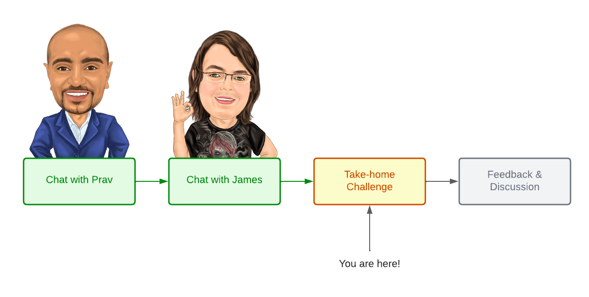
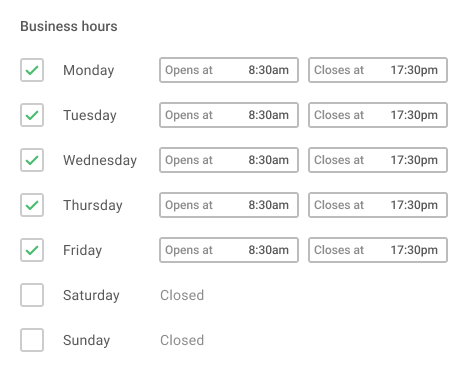
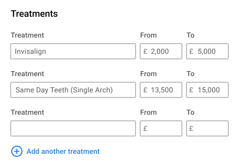

# The Fresh Take-home Challenge



You're probably here because we've been discussing a possible role at The Fresh
working on Leadflo. If that's the case, congrats!

To move forward, we need to understand how you work and, crucially, how we work
together. As such, this project includes a set of take-home challenges that you
can choose from, which you should spend no more than 4 hours on.

We will then use your work to kickstart a discussion on how you work, how we
work and how we could possibly work together. Regardless of outcome, you will
always have the opportunity for feedback (ghosting is not ok!)

## Why we do this

Hiring is hard. And we know that take-home exercises are up there with
whiteboarding.

As such, we hope our informal contract to you makes this process easier and
reduces the risk to you:

1. We respect your time and insist you spend no more than 4 hours on it. Show us
   your skills but we're looking for scope management skills just as much as
   technical chops
2. We don't want you to rush or go overboard. Work at your own pace, don't rush
   or be a perfectionist. We understand scope can force certain decisions - take
   those decisions and explain why
3. We don't expect you to complete everything too. As above, we want you to show
   us where you draw the line on dropping standards to get things over the line
3. We will give you something relevant to our domain. We're not going to ask you
   to rotate a binary tree or implement A* path finding. These exercises are
   things you could work on in an interation
4. We are fully remote so synchronous pair programming is impractical, without
   me looking over your shoulder. This is how we work day to day
5. We have provided a working development environment, using docker, kitted out
   with stack we use on the Leadflo project day to day
6. We will always give honest, constructive feedback no matter the outcome.
   Ghosting is a serious problem in recruitment and you always deserve to know
   where you stand, **no matter what**
7. We don't want a free lunch. Although these tasks are relevant to what you
   will be working on, we don't expect you to work for free and we **will not**
   use any of your code from these exercises

## Prerequisites

You will need these installed to use the provided development environment:

1. Docker for Desktop (or equivalent if Linux)
2. Node
3. Yarn
4. PHP 8.0+

## Instructions

What to do:

1. Choose an exercise
2. Create a new private repository for your work and add [James
   Dunne](https://github.com/jwdunne) as a private collaborator
3. Complete as much of the exercise in 4 hours or less using the provided
   development environment
4. Be sure to:
   1. Replace this README.md with screenshots and useful instructions
   2. Write a ROADMAP.md with suggestions on what you would add/change
   3. Include automated tests
   4. Leverage the respective type systems in both projects
   5. Document your code inline (lightly, don't go overboard)
   6. *Use Git* - a commit history is valuable
5. Let us know when you're done (email james@thefreshuk.com)
6. Wait and hear back from us - usually this will be the same day or next
   working day (we don't work weekends!)

Using the development environment:

1. Use `docker-compose up --detach` to boot the API and infrastructure
2. Run the following to start the UI:

```
cd projects/ui
yarn start
```

## Exercises

Choose a single task and:

1. Understand the user stories
2. Look at the mockup
3. Implement the UI (inclue a rudimentary save button)
4. Design and implement the API
   1. Both the read and write
5. Design and implement the persistence schema
6. Implement reading and writing to persistence

### Exercise A: Business Hours

Leadflo targets the private dentistry niche. Naturally, dental practices have
opening and closing times. We can use this information to tailor certain
automated communications so leads know when to expect a response.



**As a practice owner, I want to...**

1. View the currently configured business hours
2. Adjust the times for a certain day
3. Close the practice on a certain day

#### Considerations

Given that we will only read opening hours and not depend on it (e.g with
foreign keys), this may provide opportunities to simplify persistence. Deleting
all opening hours and re-inserting them is a viable option.

Don't worry about tenancy here. Pretend we're using a single database per
tenant.

### Exercise B: Treatments

As part of their business, private dental practices sell treatments to patients.
This is what provides value as a business. We can use this information to
calculate the total value of patients, the total value of the pipeline and each
stage within it and eventually a customer lifetime value.



**As a practice owner, I want to...**

1. View the list of treatments offered by my practice
2. Adjust the price range of existing treatments
3. Add a new treatment offered by my practice

#### Considerations

Given that this **will** be depended on in other parts of the application, we
must careful how we persist treatments. Deleting them all and re-inserting them
is **not** an option here.

Don't worry about tenancy here. Pretend we're using a single database per
tenant.